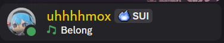
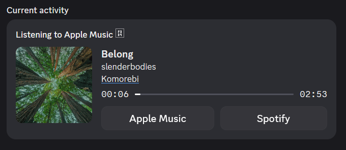

# MusicPP

Discord Rich Presence for Apple Music written in C++ using Windows Runtime APIs.





## Features

- Displays track title, artist, and album
- Shows album art sourced from Apple Music, with Spotify and Imgur as fallbacks
- Caching with [LevelDB](https://github.com/google/leveldb)
- Progress bar/ timestamps
- Tray icon for current status
- Support for "Listening to {title}" status (similar to old Spotify presence behaviour)
- Buttons to open the track in Apple Music and/ or Spotify (when found)
- Low resource usage (~5MB RAM, ~0.1% CPU, ~11MB disk space (including dependencies))

## Requirements

- Microsot VC Redist ([lastest x64](https://aka.ms/vc14/vc_redist.x64.exe))
- Spotify API Credentials ([optional](https://developer.spotify.com/dashboard))
- Imgur API Credentials ([optional](https://api.imgur.com/oauth2/addclient))

## Building from Source
1. Make sure you have CMake, Ninja and Visual Studio installed
2. Clone the repository: 
    ```sh
    git clone https://github.com/Amqx/musicpp
   ```
3. Get dependencies (VCPKG is probably easiest):
    ```sh
    vcpkg install curl leveldb cppwinrt nlohmann-json spdlog libxml2
    ```
   - CURL
   - LevelDB
   - CPPWinRT
   - nlohmann/json
   - spdlog
   - LibXml2
   
4. Install Discord Social SDK
    - Download from [Discord Developer Portal](https://discord.com/developers/docs/game-sdk/sdk-starter-guide)
    - Place the extracted into a folder named "discordsdk" in the project root directory
   
5. Configure and build the project with CMake
    ```sh
    mkdir build
    cd build
    cmake .. -G "Visual Studio 17 2022" -A x64 -DCMAKE_BUILD_TYPE=Release  -DCMAKE_MAKE_PROGRAM={path to ninja} -DCMAKE_TOOLCHAIN_FILE={path to vcpkg}
    cmake --build . --target musicpp
    ```
6. Copy the executable and all the DLLs into your preferred directory and run