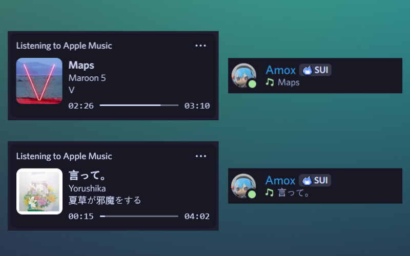

# MusicPP

Discord Rich Presence for the Windows Apple Music desktop app written in C++/WinRT.



## Features

- Rich presence with track title, artist, album, progress bar, and pause state
- Album art with Apple Music first, then Spotify, then Imgur as fallbacks (cached in LevelDB)
- Optional Last.fm now playing + scrobbling
- Tray icon showing current status and quick exit
- Presence buttons for Apple Music plus Last.fm or Spotify links (when available)
- Low resource usage (~5–10MB RAM, ~0.1% CPU, ~20MB disk with deps)

Warning: this was built for personal use; there is no runtime UI for changing settings. Anything beyond the built-in
configuration flow requires editing the source.

## Requirements

- Windows 10/11 with the Apple Music app installed
- Microsoft Visual C++ Redistributable x64 ([latest](https://aka.ms/vc14/vc_redist.x64.exe))
    - You may already have this: Look in Settings -> Apps -> Installed apps and search for "Microsoft Visual C++ v14
      Redistributable"
- Optional API credentials:
    - Spotify Client ID + Secret ([Available Here](https://developer.spotify.com/dashboard))
    - Imgur Client ID ([Available Here](https://api.imgur.com/oauth2/addclient))
    - Last.fm API Key + Secret ([Available Here](https://www.last.fm/api/account/create))

## First Run & Configuration

1. Download the latest release [here](https://github.com/Amqx/musicpp/releases/latest) or build from source (
   instructions below).
2. On first launch (or after reset) you will be prompted in the console for the API keys above.
3. After 3 seconds the console closes and MusicPP keeps running from the system tray. Right-click the tray icon to exit.

Saved data:

- Cache/DB: `%LOCALAPPDATA%\\musicpp\\song_db`
- Logs: `%LOCALAPPDATA%\\musicpp\\logs`

## Building from Source

When building from source, if you intend to move the final .exe somewhere, make sure to bring the .dlls with it.

### CLion

The simplest path is CLion with VCPKG integration.

1. Install [CLion](https://www.jetbrains.com/clion/) and Microsoft Visual Studio Build Tools (Community works):
   ```powershell
   winget install --id=Microsoft.VisualStudio.2022.Community
   ```
2. Clone the project:
   ```powershell
   git clone https://github.com/Amqx/musicpp
   ```
3. Install the VCPKG plugin and enable integration for the project (VCPKG -> Edit -> Add Vcpkg integration to existing
   CMake Profiles).
4. Install dependencies:
   ```powershell
   ~/.vcpkg-clion/vcpkg/vcpkg.exe install curl leveldb cppwinrt nlohmann-json spdlog libxml2
   ```
5. Install the Discord Social SDK into `discordsdk/` (see next section).
6. Build and run from CLion (Shift + F10).

### Manual (CMake + Ninja)

1. Install CMake, Ninja, and Visual Studio Build Tools:
   ```powershell
   winget install --id=Kitware.CMake
   winget install --id=Ninja-build.Ninja
   winget install --id=Microsoft.VisualStudio.2022.Community
   ```
2. Clone the repository:
   ```powershell
   git clone https://github.com/Amqx/musicpp
   ```
3. Install dependencies (VCPKG is easiest):
   ```powershell
   vcpkg install curl leveldb cppwinrt nlohmann-json spdlog libxml2
   ```
4. Install the Discord Social SDK into `discordsdk/` (see next section).
5. Configure and build:
   ```powershell
   mkdir build
   cd build
   cmake .. -G "Visual Studio 17 2022" -A x64 -DCMAKE_TOOLCHAIN_FILE={path-to-vcpkg}/scripts/buildsystems/vcpkg.cmake
   cmake --build . --config Release --target musicpp
   ```

## Installing the Discord Social SDK

Download the SDK from the [Discord Developer Portal](https://discord.com/developers/docs/game-sdk/sdk-starter-guide) (
log in required). Choose the package without Unity/Unreal. Extract `discord_social_sdk-{version}.zip`, copy
`discord_social_sdk` into the project root, rename it to `discordsdk`, and keep the `bin`, `lib`, and `include` folders
intact so CMake can find them.

## Customization

### Discord Rich Presence

You can change the presence content in `src/discordrp.cpp` inside `void Discordrp::update()`. Available metadata has
already been extracted for you:

- Title (`title`)
- Artist (`artist`)
- Album (`album`)
- Image link (`imglink`)
- Apple Music link (`amlink`)
- Last.fm link (`LFMlink`)
- Spotify link (`splink`)
- Current playback state (`playing`)
- Playback start (`start_ts`)
- Projected end (`end_ts`)
- Pause timestamp (`pause_ts`)

Check links for emptiness before using them, and pick timestamps based on the current playback state (start/end when
playing, pause when not). Discord buttons are only visible to other users, not on your own profile.

### Last.fm Scrobbling Behaviour

Tunables live in `include/constants.h` under the Last.fm section. Read
the [Last.fm scrobble docs](https://www.last.fm/api/show/track.scrobble)
and [guidelines](https://www.last.fm/api/scrobbling) before changing values. Available settings (format: description (
type)(var)(min)):

- Maximum scrobble attempts (int)(kMaxScrobbleAttempts)
- Maximum now playing attempts (int)(kMaxSetNowPlayingAttempts)
- Minimum track length in seconds (int)(kLfmMinTime)(30)
- Percentage of duration before scrobble (double)(kLfmPercentage)(0.5)
- Time before auto-scrobble in seconds (int)(kLfmElapsedTime)(240)
